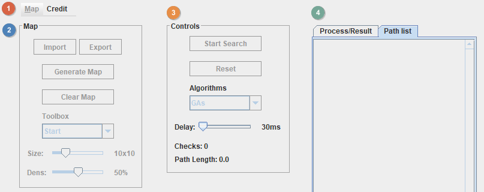

<!-- omit in toc -->
# Path Finding

Keywords: _`mobile robot`, `autonomous mobile robots` `static environments`, `2-dimensional (2D) space`, `environmental modeling`, `path planning`_

Từ khóa: _`rô bốt di động`, `rô bốt di động tự trị`, `môi trường tĩnh`, `không gian 2 chiều`, `mô hình hóa môi trường`, `lập lịch đường đi`_

<!-- omit in toc -->
## 🚩 Table of Contents
- [Description](#description)
  - [YouTube Video](#youtube-video)
- [Dijkstra](#dijkstra)
- [A*](#a)
- [Draw a maze](#draw-a-maze)
- [How to add your algorithm](#how-to-add-your-algorithm)
- [Some usefull tips](#some-usefull-tips)

## Description
This program provides a visual demonstration of the process undergone by Dijkstra, A* (A star) and GAs (Genetic Algorithm).

### [YouTube Video](https://www.youtube.com/watch?v=xGdBwdd_FLc&t)

## Dijkstra
Dijkstra's algorithm works by first adding the starting node to a priority queue. It then takes the top node in the priority queue and looks at all of the nodes surrounding it. If the nodes are valid positions then they are added to the priority queue and the top node in the queue is deleted. These nodes that are added to the queue also have a knowledge of what node they were explored from (ie. their parent node) This process is continued until a node is discovered with the same location as the finish node. From that node, a path is created by retracing the steps to the starting node. 


## A*
A* works similarly to dijkstra by creating a priority queue of nodes and then adding new nodes to the queue by exploring the top node on the queue. However in A* the nodes are placed into the queue with a heuristic of distance to the finish node. This means that the node at the top of the queue is always the node closest to the finish node.


## Draw a maze


## How to add your algorithm

1. Go to the line 85 and add your algorithm name.

```java
85   private String[] algorithms = { "GAs", "Dijkstra", "A*" };
```

1. Add your (public) algorithm function inside of class Algorithm, line 797.

```java
797  class Algorithm {	//ALGORITHM CLASS
```

1. Go to funtion ```startSearch()``` in line 587 and add a case (the number following the way you arranged in step 1) to call your function which you written in step 2. (```Alg``` is a instance of class ```Algorithm```).

```java
587  public void startSearch() {	//START STATE
...     // ... Other code
589         switch(curAlg) {
590             case 0:
591                 Alg.GAs();
592                 break;
593             case 1:
594                 Alg.Dijkstra();
595                 break;
596             case 2:
597                 Alg.AStar();
598                 break;
599         }
```

## Some usefull tips

1. To show the detail of processing or result of your algorithm, there is a instance of JTextArea (variable name ```textArea```) which you can call function setText()/append().

2. To show the length of the final path, assign value to variable ```length``` (type double, call ```round()``` function).

3. To show how many cells/nodes have been checked by algorithm, assign value to variable ```checks``` (type int).

4. To calculate & show elapsed time, add the following code:

```java
...  watch.start();
...  // call to the methods you want to benchmark
...  watch.stop();
...  elapsed = watch.getTime();
```

6. If you needs the list of wall nodes, there is a variable name ```wallList``` (type ArrayList\<Node\>).

7. Call ```Update()``` to repaint the canvas, then call ```delay()```, so you'll have time to see the changed.

8. To show the path(s) as a line, add the path(s) to variable ```pathList``` (type ArrayList\<ArrayList\<Node\>\>). Or else set the type of the node = 5 (the color of the node will be yellow in the canvas &rarr; **this should be applying for the final path**).

9. Call ```setEnableWorkableComponents()``` function to dis/enable some controls (see the image below).



8. If you needs map size like 16x16 or 13x9, press <kbd>Alt</kbd> + <kbd>C</kbd> to open Custom map size dialog.

9.  To show the tab **Path list** first, change value 0 &rarr; 1 in the line 439.
    
```java
439  tabbedPane.setSelectedIndex(0);
```